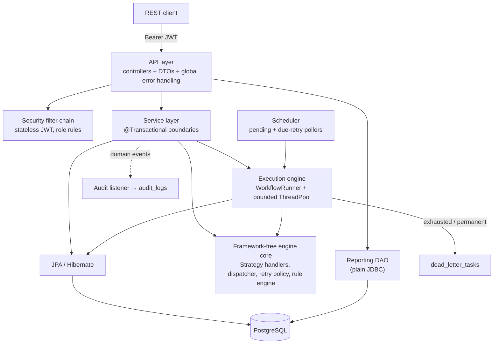
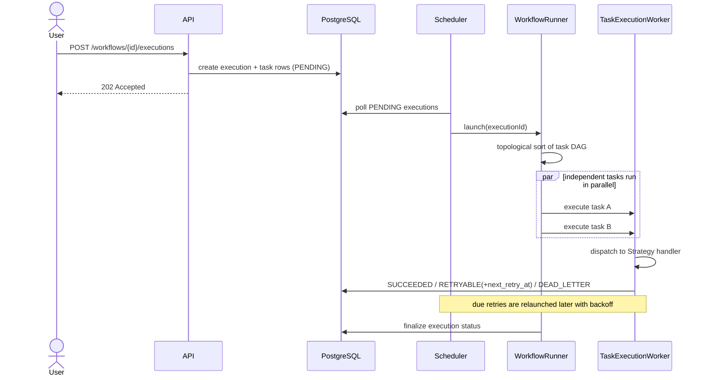
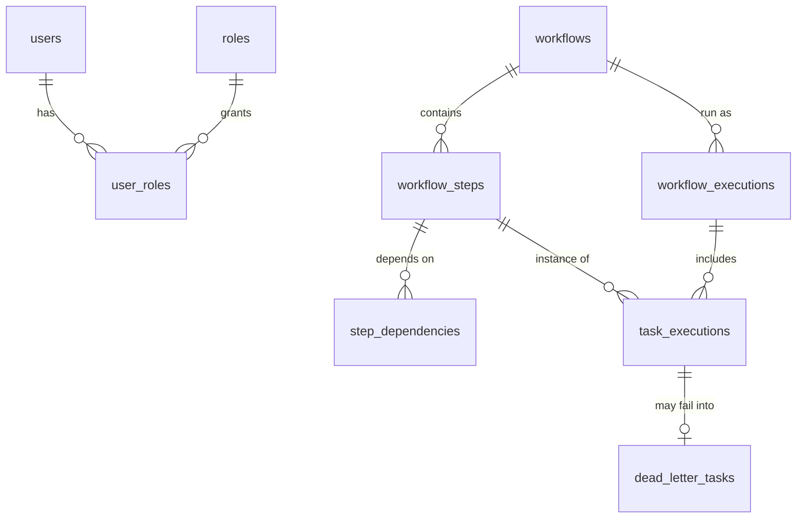

# FlowForge

**An enterprise workflow & job orchestration engine** — define multi-step workflows as a
dependency DAG, execute their tasks concurrently, retry transient failures with
exponential backoff, dead-letter the permanently broken ones, and audit everything —
built on **Java 21** and **Spring Boot 4**.

FlowForge is deliberately **not** another CRUD app. Its centre of gravity is a
**framework-free execution engine** (plain Java: Strategy handlers, a topological
scheduler, a bounded thread pool, exponential-backoff retries) with Spring, Hibernate and
PostgreSQL layered around the edges.

---

## Table of contents

- [Why FlowForge](#why-flowforge)
- [Feature highlights](#feature-highlights)
- [Architecture](#architecture)
- [Execution model](#execution-model)
- [Tech stack (and why)](#tech-stack-and-why)
- [Database design](#database-design)
- [Getting started](#getting-started)
- [Environment variables](#environment-variables)
- [API examples](#api-examples)
- [Security model](#security-model)
- [Concurrency model](#concurrency-model)
- [Retry & dead-letter model](#retry--dead-letter-model)
- [Transaction strategy](#transaction-strategy)
- [JPA vs JDBC — a deliberate split](#jpa-vs-jdbc--a-deliberate-split)
- [Testing](#testing)
- [Observability](#observability)
- [Performance](#performance)
- [Project structure](#project-structure)
- [Known limitations](#known-limitations)
- [Future improvements](#future-improvements)
- [Further reading](#further-reading)

---

## Why FlowForge

Interviewers have seen a hundred CRUD apps. FlowForge is designed to create **hard,
interesting questions** and give defensible answers to them:

- **Real concurrency**, not buzzwords: a bounded `ThreadPoolExecutor` + `CompletableFuture`
  composition that runs a dependency DAG in parallel, with graceful shutdown.
- **Framework-independent core**: the engine and rule engine don't import Spring at all —
  Ports & Adapters in practice.
- **Both JDBC and JPA**, each where it earns its keep, documented.
- **Production concerns**: migrations, optimistic locking, retries, dead-letter queue,
  stateless JWT security, metrics, Docker.

## Feature highlights

- Workflow definitions with ordered steps and a **dependency DAG**
- **Concurrent execution** honouring dependencies (topological scheduling)
- **Retry** with exponential backoff + **dead-letter queue** with replay
- **Scheduling** (auto-start pending executions, relaunch due retries)
- Extensible **task types** via the Strategy pattern (email, webhook, approval, custom)
- Extensible **rule engine** (e.g. approval routing)
- **Event-driven audit** trail (`@TransactionalEventListener`)
- **Spring Security + JWT**, role-based (ADMIN / MANAGER / OPERATOR / VIEWER)
- **Actuator + Micrometer** metrics, MDC-correlated logging
- **Flyway** migrations; **Testcontainers** integration tests; **Docker Compose**

## Architecture



The **core** (`com.flowforge.engine.*`, `com.flowforge.engine.rules.*`) is pure Java and is
unit-tested without booting Spring. Everything Spring/JPA/web is an adapter around it.

## Execution model



## Tech stack (and why)

| Area | Choice | Why |
|---|---|---|
| Language / runtime | **Java 21** (LTS) | records, pattern matching, virtual-thread-ready |
| Framework | **Spring Boot 4** (Spring Framework 7) | current line; DI, web, tx, security |
| Persistence | **Hibernate/JPA** + **plain JDBC** | ORM for writes, SQL for read-model aggregates |
| Database | **PostgreSQL** | JSONB, `FILTER`, robust indexing |
| Migrations | **Flyway** | versioned, reviewable schema; never auto-DDL in prod |
| Security | **Spring Security 7 + JWT** (HS256) | stateless, role-based |
| Metrics | **Micrometer + Actuator** (Prometheus) | health + custom metrics |
| Testing | **JUnit 5, AssertJ, MockMvc, Testcontainers** | unit + real-DB integration |
| Packaging | **Docker + Compose** | one-command reproducible run |

No Redis/Kafka: they'd be resume-padding here. The single-instance scheduler limitation is
documented instead (see [Known limitations](#known-limitations)).

## Database design

Owned by **Flyway** (`src/main/resources/db/migration`); Hibernate runs `ddl-auto=validate`
and never alters the schema. Deep rationale in **[docs/database.md](docs/database.md)**.



Notable choices: `BIGINT GENERATED BY DEFAULT AS IDENTITY` PKs, `TIMESTAMPTZ`, `JSONB` for
flexible config/payloads, `VARCHAR + CHECK` for enums (portable, maps to
`@Enumerated(STRING)`), a `version` column for optimistic locking. **No** separate
`retry_queue` (retry state is columns on `task_executions`) — but a dedicated
`dead_letter_tasks` (different lifecycle/retention).

## Getting started

**Prerequisites:** JDK 21, Maven 3.9+, PostgreSQL 16+ (or Docker). Full step-by-step (incl.
Windows specifics) in **[docs/SETUP.md](docs/SETUP.md)**.

**Local (against your own Postgres):**
```bash
# one-time: create the DB + role (see docs/SETUP.md), then:
mvn spring-boot:run
```
The git-ignored `application-local.yml` supplies local DB creds + a dev JWT secret, and a
bootstrap `admin` user is created on first start.

**Everything in Docker:**
```bash
docker compose up --build
```

## Environment variables

| Variable | Purpose | Local default |
|---|---|---|
| `DB_HOST` / `DB_PORT` / `DB_NAME` | PostgreSQL location | localhost / 5432 / flowforge |
| `DB_USERNAME` / `DB_PASSWORD` | app DB credentials | flowforge / (from `application-local.yml`) |
| `FLOWFORGE_JWT_SECRET` | HS256 signing key (≥ 32 bytes) | dev value in `application-local.yml` |
| `FLOWFORGE_JWT_EXP_MIN` | token lifetime (minutes) | 60 |
| `FLOWFORGE_ADMIN_PASSWORD` | bootstrap admin password | admin12345 |
| `SPRING_PROFILES_ACTIVE` | active profile | local |

Secrets are **never** committed; `.env.example` documents them.

## API examples

```bash
# 1) Log in -> JWT
TOKEN=$(curl -s -XPOST localhost:8080/auth/login -H "Content-Type: application/json" \
  -d '{"username":"admin","password":"admin12345"}' | sed -E 's/.*"token":"([^"]+)".*/\1/')

# 2) Create a workflow (MANAGER/ADMIN)
curl -s -XPOST localhost:8080/api/v1/workflows -H "Authorization: Bearer $TOKEN" \
  -H "Content-Type: application/json" -d '{
    "name":"Onboarding","priority":"HIGH",
    "steps":[
      {"name":"crm","taskType":"WEBHOOK","stepOrder":1,"parameters":{"url":"http://crm","simulateStatus":"200"}},
      {"name":"email","taskType":"EMAIL","stepOrder":2,"parameters":{"to":"a@b.com"},"dependsOn":[1]}
    ]}'

# 3) Activate, trigger, then start it running
curl -s -XPUT  localhost:8080/api/v1/workflows/1 -H "Authorization: Bearer $TOKEN" \
  -H "Content-Type: application/json" -d '{"status":"ACTIVE"}'
curl -s -XPOST localhost:8080/api/v1/workflows/1/executions -H "Authorization: Bearer $TOKEN"
curl -s -XPOST localhost:8080/api/v1/executions/1/start     -H "Authorization: Bearer $TOKEN"

# 4) Observe
curl -s localhost:8080/api/v1/executions/1 -H "Authorization: Bearer $TOKEN"
curl -s localhost:8080/api/v1/reports/dashboard -H "Authorization: Bearer $TOKEN"

# 5) Rule engine
curl -s -XPOST localhost:8080/api/v1/rules/route-approval -H "Authorization: Bearer $TOKEN" \
  -H "Content-Type: application/json" -d '{"priority":"HIGH","amount":200000}'   # -> SENIOR_APPROVER
```

Errors come back in one consistent envelope (`timestamp, status, error, message, path,
fieldErrors`) via a global `@RestControllerAdvice`.

## Security model

Stateless JWT (HS256). Authentication (`AppUserDetailsService` + BCrypt) is cleanly
separated from authorization (URL role rules in `SecurityConfig`).

| Role | Can |
|---|---|
| VIEWER | read workflows/executions/reports |
| OPERATOR | + trigger/start executions |
| MANAGER | + author/update workflows |
| ADMIN | + manage users, replay dead letters |

## Concurrency model

- One **bounded `ThreadPoolExecutor`** (`TaskWorkerPool`) runs task attempts; bounded queue
  + `CallerRunsPolicy` provide back-pressure; graceful `@PreDestroy` shutdown.
- `WorkflowRunner` topologically sorts the DAG and composes one `CompletableFuture` per
  task (`allOf(predecessors).thenApplyAsync(run-or-cancel, pool)`), so independent tasks run
  in parallel and dependents wait.
- Each task attempt is its **own transaction** on its own thread, updating its own row — no
  contention; `@Version` guards the rare concurrent update.
- `ExecutionLauncher` de-duplicates in-flight executions with a `ConcurrentHashMap` set.

## Retry & dead-letter model

- Handlers classify failures as **retryable** (timeout, 5xx/429) or **permanent** (4xx,
  validation). `RetryPolicy` computes exponential backoff (`1s, 2s, 4s, …`, capped).
- Retryable + attempts left → `RETRYABLE_FAILURE` with `next_retry_at`; the scheduler
  relaunches when due. Exhausted or permanent → `dead_letter_tasks` (inspect + **replay**).

## Transaction strategy

`@Transactional` boundaries live in the service layer. "Create workflow → steps →
dependencies" is one all-or-nothing transaction. Reads are `readOnly`. Audit uses
`@TransactionalEventListener(AFTER_COMMIT)` + `REQUIRES_NEW` so it records only committed
changes. Optimistic locking (`@Version`) surfaces concurrent updates as HTTP 409.

## JPA vs JDBC — a deliberate split

| Operation | Tech | Reason |
|---|---|---|
| Domain writes (workflows, executions, tasks) | **JPA/Hibernate** | identity, cascades, dirty checking, optimistic locking |
| Dashboard/aggregate reads | **plain JDBC** (`ReportingJdbcDao`) | `GROUP BY`/`JOIN` projections with no entity to hydrate |

A lightweight CQRS flavour — documented, not random. See [docs/database.md](docs/database.md).

## Testing

- **Unit tests** for the framework-free core (engine, retry math, rule engine) — no Spring.
- **Integration tests** against real PostgreSQL (env-gated for local dev; a Testcontainers
  variant runs anywhere Docker is available).
- **MockMvc** tests through the full web + security stack.

```bash
mvn test                                   # fast unit tests
DB_NAME=flowforge ... mvn test             # + integration tests (see docs/SETUP.md)
```

## Observability

- Actuator: `/actuator/health`, `/info`, `/metrics`, `/prometheus`.
- Custom Micrometer meters: `flowforge.executions.triggered`, `flowforge.task.duration`,
  `flowforge.tasks.completed{status}`, `flowforge.worker.pool.active|queue.size`.
- Logs carry `executionId` / `correlationId` via MDC.

## Performance

A reproducible benchmark shows the concurrency win (I/O-bound tasks): **~6× speedup** at
pool size 8. Profiling guide (IntelliJ, JFR, Hibernate stats, Postgres `EXPLAIN ANALYZE`)
in **[docs/PERFORMANCE.md](docs/PERFORMANCE.md)**.

## Project structure

```
com.flowforge
├─ engine/                 framework-free core
│  ├─ (dispatcher, handlers, retry, model)
│  ├─ execution/           thread pool, runner, worker, launcher
│  ├─ scheduling/          pending + retry pollers
│  ├─ rules/               rule engine
│  └─ events/              domain events
├─ domain/                 JPA entities, enums, repositories
├─ service/                @Transactional application services, audit
├─ api/                    controllers, DTOs, mapper, error handling, validation
├─ security/               JWT, user details, security config
└─ reporting/              JDBC reporting DAO + DTOs
```

## Known limitations

- **Single-instance scheduler** — the pollers assume one running app. Multi-instance would
  need a shared lock (ShedLock) or `SELECT … FOR UPDATE SKIP LOCKED`.
- **Simulated integrations** — email/webhook are simulated; the focus is orchestration.
- **CUSTOM tasks from the DB** need a named-action registry to supply Java logic.
- **Execution list** endpoint can N+1 on tasks (fine at current scale; would use a
  projection/fetch join to scale).

## Future improvements

- Distributed scheduling (ShedLock / `SKIP LOCKED`), virtual threads for the worker pool,
  a named-action registry for CUSTOM tasks, webhook/email real adapters, OpenAPI/Swagger UI,
  workflow versioning, and per-tenant isolation.

## Further reading

- [docs/SETUP.md](docs/SETUP.md) — every manual setup step
- [docs/database.md](docs/database.md) — schema & the JDBC/JPA split
- [docs/PERFORMANCE.md](docs/PERFORMANCE.md) — benchmark & profiling
- [docs/INTERVIEW.md](docs/INTERVIEW.md) — interview Q&A bank
